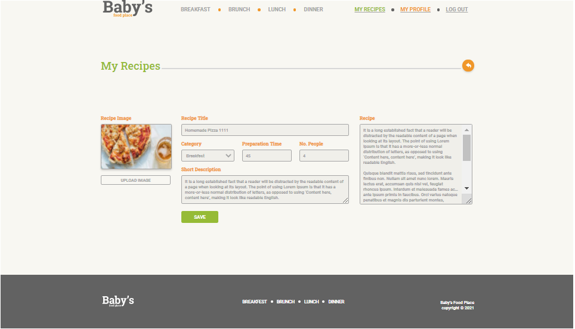
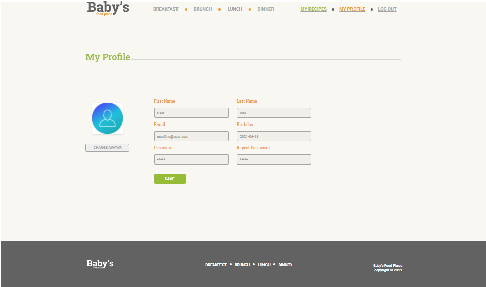
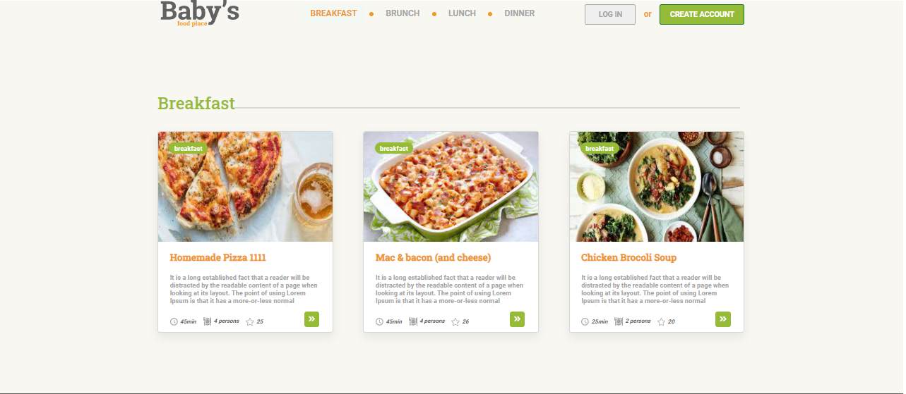
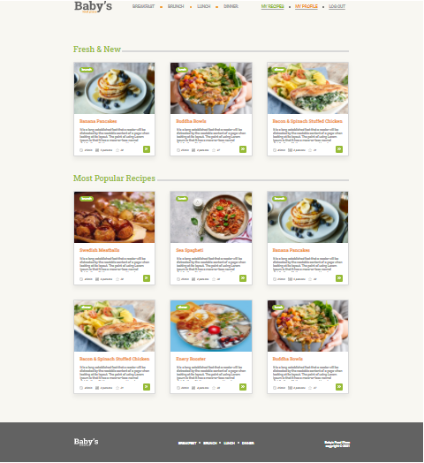
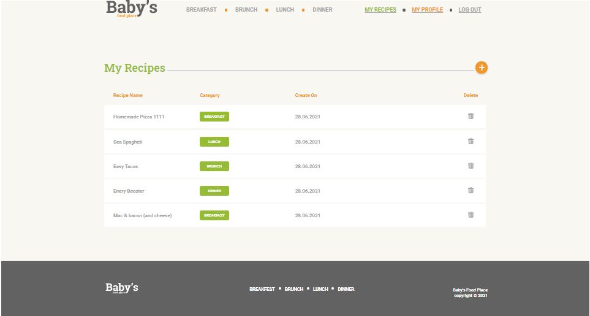
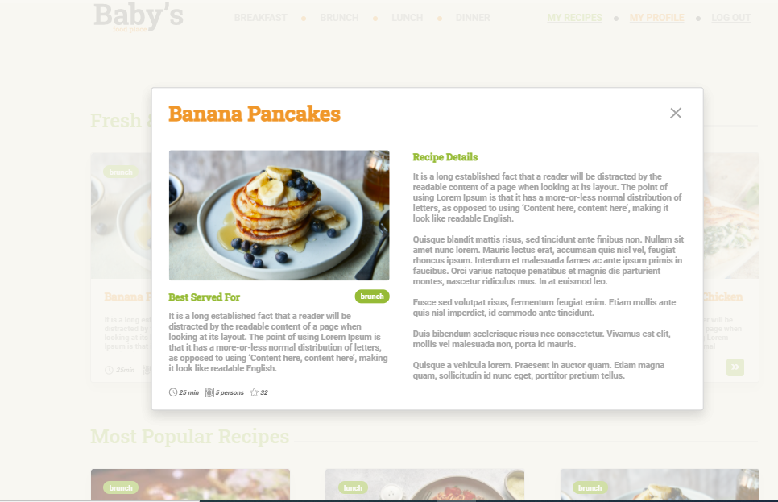

# Baby Food Place Project
Baby Food Place is a web application about listing, creating, updating recipes by user using Node.JS and React.JS technologies.
As store database is used MongoDB with mongoose.

## Run Locally
### 1. Clone repo
```
$ git clone https://github.com/sanjanastevska/baby-food-place.git
$ cd baby-food-place 
```

### 2. Install MongoDB
Download it from here: https://docs.mongodb.com/manual/administration/install-community/

### 3. Run Backend
```
$ cd backend
$ npm start
```

### 4. Run Frontend
```
#open new terminal
$ cd frontend
$ npm start
```
### 5. Create User
- Run this on chrome: http://localhost:3000/register
- Enter user's first name, last name, birthday, email and password and click register.
- Activate the user account by clicking on the activation link from the mailbox to verify their email Id.

### 6. Login
- Run http://localhost:3000/login
- Enter email and password and click signin

### 7. Create Recipes
- Run http://localhost:3000/recipes
- Logged in user can create/update a recipe by entering recipe info

## Screens









 




